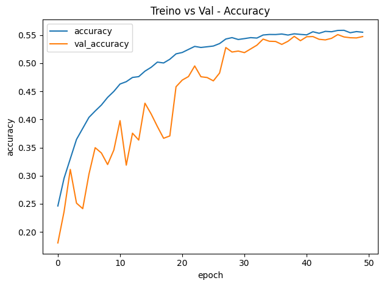
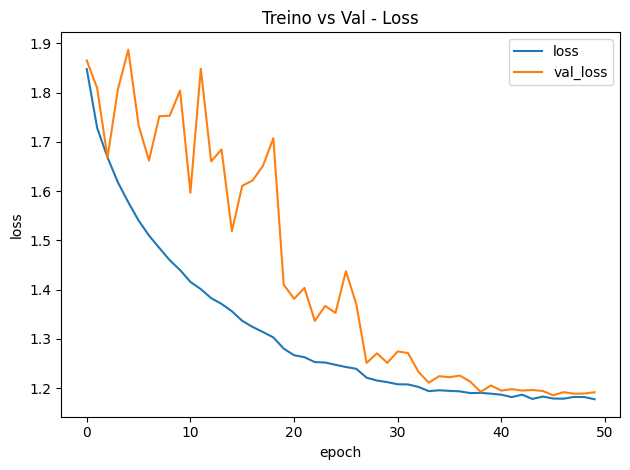
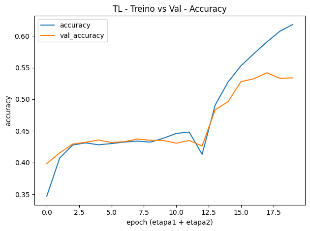
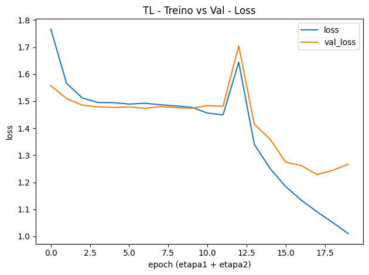
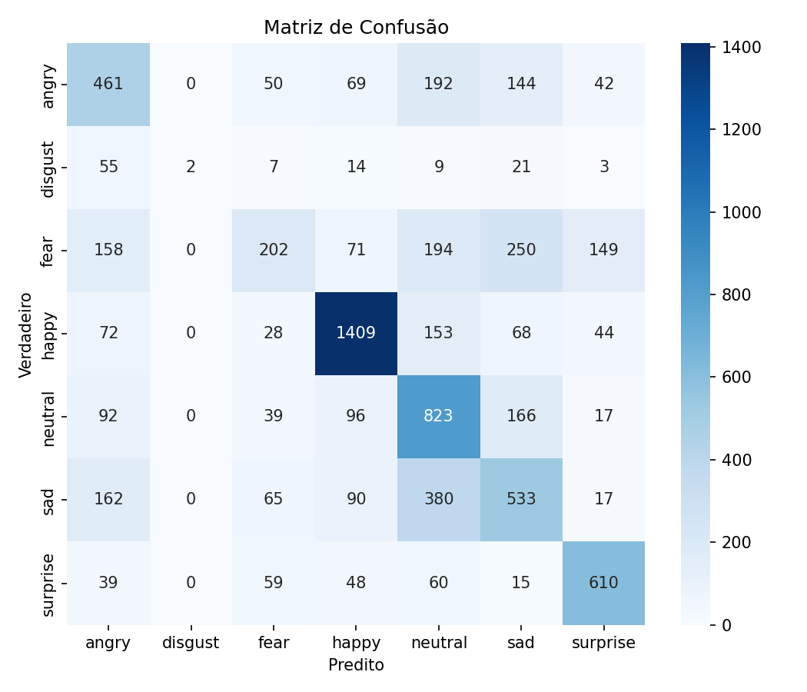
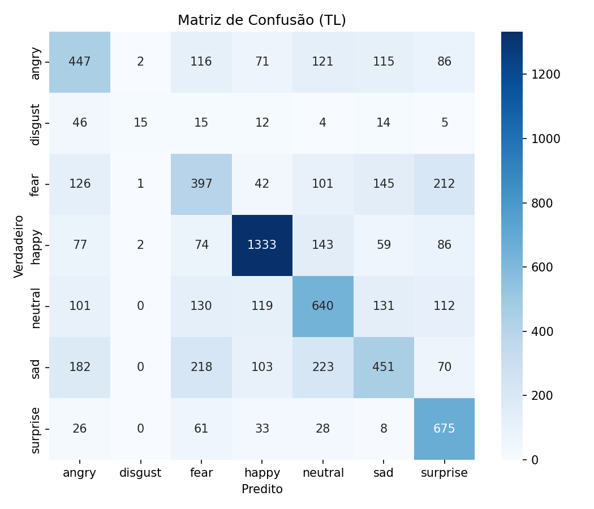

# Reconhecimento de Emoções Faciais (CNN + Transfer Learning)

Projeto da disciplina **Fundamentos de IA**: uma rede neural que classifica **expressões faciais** nas classes
`angry, disgust, fear, happy, neutral, sad, surprise`.

Há **duas linhas** de modelo neste repositório:

1. **Baseline** – CNN simples, imagens **48×48** em **tons de cinza**.
2. **Transfer Learning (TL)** – **MobileNetV2** pré-treinada (ImageNet), **96×96 RGB** + *fine-tuning*, com app robusto (detecção de face + média de variações na inferência).

---

## Demonstração (local)

Após treinar, rode:

* **Baseline**

  ```bash
  python app.py
  ```
* **Transfer Learning (recomendado)**

  ```bash
  python src/app_tl.py
  ```

A interface abrirá no navegador (Gradio). Faça upload de uma foto de rosto.

> A versão TL detecta e recorta a face, faz melhorias de luz/contraste e gera **múltiplas variações** (equalização, *gamma* 0.9/1.2 e espelhamento). A predição final é a **média** das probabilidades — isso dá robustez em fotos reais.

---

## Estrutura do repositório

```
.
├─ data/                    # dataset em pastas
│  ├─ train/
│  │  ├─ angry/ …           # imagens por classe
│  │  ├─ disgust/ …
│  │  └─ …
│  └─ test/
│     ├─ angry/ …
│     └─ …
├─ models/                  # arquivos gerados (pesos, relatórios e gráficos)
│  ├─ modelo.keras
│  ├─ model_tl.keras
│  ├─ class_names.json
│  ├─ history.json / history_tl.json
│  ├─ report.txt / report_tl.txt
│  ├─ curve_acc.png / curve_loss.png
│  └─ confusion_matrix.png / confusion_matrix_tl.png
├─ src/
│  ├─ data.py               # loader baseline (48×48 gray)
│  ├─ model.py              # CNN baseline
│  ├─ train.py              # treino baseline
│  ├─ eval.py               # avaliação baseline
│  ├─ plot_curves.py        # curvas baseline
│  ├─ data_tl.py            # loader TL (96×96 RGB) + class weights
│  ├─ model_tl.py           # MobileNetV2 + fine-tuning
│  ├─ train_tl.py           # treino em 2 etapas (congelada → FT)
│  ├─ eval_tl.py            # avaliação TL
│  └─ plot_curves_tl.py     # curvas TL
├─ app.py                   # demo baseline
└─ src/app_tl.py            # demo TL (face detection + robust inference)
```

---

## Dataset (formato esperado)

Organize suas imagens assim:

```
data/train/<classe>/*.jpg|png
data/test/<classe>/*.jpg|png
```

Classes suportadas (ordem automática do loader):
`angry, disgust, fear, happy, neutral, sad, surprise`.

> Dica: quanto mais **rostos bem recortados**, melhor. Fotos muito abertas (muito fundo/cabelo) confundem o modelo.

---

## Ambiente recomendado (rápido e com GPU)

### WSL2 + Ubuntu + TensorFlow GPU (oficial)

1. **Instalar/abrir WSL Ubuntu** (no Windows):

   ```powershell
   wsl --install -d Ubuntu
   ```

   Atualize seu **driver NVIDIA** no Windows.

2. **No Ubuntu (WSL)**:

   ```bash
   sudo apt update && sudo apt -y upgrade
   sudo apt -y install python3-venv python3-pip git rsync
   python3 -m venv ~/tf
   source ~/tf/bin/activate
   python -m pip install --upgrade pip
   pip install "tensorflow[and-cuda]"     # instala TF + CUDA/cuDNN compatíveis
   ```

3. **Trazer o projeto para o WSL** (opção: copiar da partição Windows sem o `.git`):

   ```bash
   mkdir -p ~/emotions-rna
   rsync -a --info=progress2 --exclude=".git" "/mnt/c/Users/SEU_USUARIO/Documents/Projetos/emotions-rna/" ~/emotions-rna/
   cd ~/emotions-rna
   ```

4. **Instalar dependências do projeto** (TensorFlow já instalado na etapa anterior):

   ```bash
   pip install -r requirements.txt
   ```

5. **Testar a GPU**:

   ```bash
   python - << 'PY'
   import tensorflow as tf
   print(tf.config.list_physical_devices("GPU"))
   PY
   ```

   Deve listar `GPU:0 (NVIDIA GeForce RTX 3060 …)`.

> Observação: TensorFlow GPU suporta Python **3.9–3.12** no momento. Use uma venv com uma dessas versões no WSL.

---

## Como rodar (treino, avaliação e gráficos)

### 1) Baseline (CNN 48×48 grayscale)

```bash
# Treinar
python src/train.py

# Curvas (gera models/curve_acc.png e models/curve_loss.png)
python src/plot_curves.py

# Avaliar (gera models/report.txt e models/confusion_matrix.png)
python src/eval.py
```

### 2) Transfer Learning (MobileNetV2 96×96 RGB)

Treino em **duas etapas**:

* **Etapa 1**: base congelada
* **Etapa 2**: libera as **N últimas camadas** para *fine-tuning*

```bash
# Treino (recomendado na GPU)
python src/train_tl.py --batch-size 128 --epochs1 12 --epochs2 12 --unfreeze-top 30
# (se faltar VRAM: tente --batch-size 96)

# Curvas (etapa1 + etapa2 concatenadas)
python src/plot_curves_tl.py

# Avaliação (gera report_tl.txt e confusion_matrix_tl.png)
python src/eval_tl.py
```

**Parâmetros úteis (TL)**

* `--batch-size`: aumente até o limite da VRAM (reduza se ocorrer OOM).
* `--unfreeze-top`: quantas camadas do topo liberar na etapa 2 (20–60 costuma ir bem).
* `--epochs1 / --epochs2`: épocas por etapa.
* `--fast`: modo rápido de depuração (usa poucos *batches*).

---

## App (Gradio)

* **Baseline**

  ```bash
  python app.py
  ```
* **TL (recomendado)**

  ```bash
  python src/app_tl.py
  ```

### Pipeline de inferência (TL)

1. Detecta a **face** (Haar Cascade), recorta com **margem** e redimensiona para **96×96**.
2. Gera **5 variações** da mesma face (normal, equalização no canal V, gamma 0.9, gamma 1.2 e espelhamento).
3. O modelo estima as probabilidades de cada variação e o app retorna a **média**.
4. Se a maior probabilidade < **0.50**, a interface sinaliza **“baixa confiança”**.

---

## Reprodutibilidade

* Seeds fixas (`42`) e **mixed precision** ativada (`float16` com saída `float32`) nos treinos.
* Avaliação e teste **sem shuffle**.
* **Pesos de classe** calculados a partir dos diretórios de treino (reduz viés por desbalanceamento).

---

## Resultados (substitua com os seus)

Após rodar `eval.py` e `eval_tl.py`, preencha a tabela com **acurácia** e **Macro-F1** (consulte `models/report*.txt`):

| Modelo                          | Input       | Acurácia (teste) |    Macro-F1 | Observações                       |
| ------------------------------- | ----------- | ---------------: | ----------: | --------------------------------- |
| Baseline (CNN)                  | 48×48, gray |      *0.5628* | *0.4642* | leve; confunde “happy × surprise” |
| Transfer Learning (MobileNetV2) | 96×96, RGB  |      *0.5514* | *0.4883* | melhor robustez em fotos reais    |


**Curvas (baseline)**  
 
 

**Curvas (TL)**  
 
 

**Matrizes de confusão**  
 
 

---

## Dicas de performance

* **GPU + mixed precision** (já habilitado) trazem grande ganho em RTX 30xx.
* Suba `--batch-size` gradualmente até o limite da VRAM; se der **OOM**, reduza.
* O pipeline usa `prefetch(AUTOTUNE)` e (quando útil) `cache()`.
* No *fine-tuning*, se a validação oscilar:

  * reduza `--unfreeze-top` (ex.: 20), **ou**
  * aumente `--epochs2` e use **ReduceLROnPlateau** (já ativo).

---

## Troubleshooting

* **GPU não aparece no WSL**
  Atualize o driver NVIDIA no Windows e rode `nvidia-smi` no Ubuntu. Na venv:
  `pip install "tensorflow[and-cuda]"` e teste `tf.config.list_physical_devices("GPU")`.

* **Aviso “cache\_dataset\_ops… did not fully read the dataset”**
  Acontece quando se usa `take()` após `cache()`. Nos scripts atuais, o `take()` (modo `--fast`) ocorre **antes** do cache — avisos resolvidos.

* **`FileNotFoundError: models/model_tl.keras`**
  Rode o treino antes: `python src/train_tl.py`.

* **`cannot find data/train`**
  Verifique a estrutura das pastas em `data/train/<classe>` e `data/test/<classe>`.

* **Memória insuficiente (OOM)**
  Diminua `--batch-size` e/ou `--unfreeze-top`. Feche outros processos que usam GPU.

---

## Como replicar rapidamente

```bash
# 0) Ativar venv (WSL)
source ~/tf/bin/activate

# 1) Instalar deps (TF já instalado via [and-cuda])
pip install -r requirements.txt

# 2) Treinar TL (exemplo estável)
python src/train_tl.py --batch-size 128 --epochs1 12 --epochs2 12 --unfreeze-top 30

# 3) Avaliar e gerar gráficos
python src/plot_curves_tl.py
python src/eval_tl.py

# 4) Demo
python src/app_tl.py
```

---

## Licença

Defina a licença do projeto (ex.: MIT).
Crie um arquivo `LICENSE` na raiz se desejar.

---

## Agradecimentos

* Arquiteturas Keras/TF e MobileNetV2 (ImageNet).
* Comunidade FER/emoções por datasets amplamente utilizados.
* Colegas e professora da disciplina pela orientação.

---

<!--
Opcional: badge "Open in Colab" (troque SEU_USUARIO/SEU_REPO)
[]
(https://colab.research.google.com/github/SEU_USUARIO/SEU_REPO/blob/main/notebooks/02_treino_colab.ipynb)
-->
